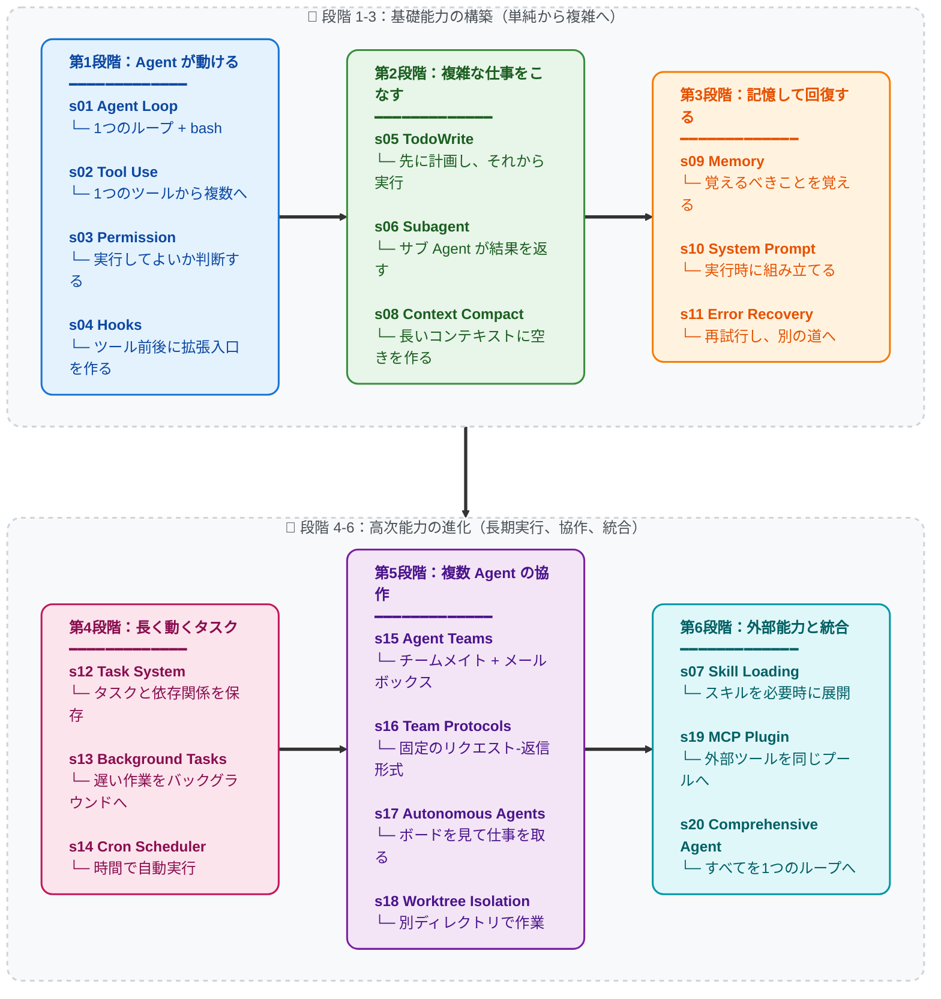

[English](./README.md) | [中文](./README-zh.md) | [日本語](./README-ja.md)

<<<<<<< HEAD
## Agency はモデルから生まれる。Agent プロダクト = モデル + Harness

コードの話をする前に、一つ明確にしておく。

**Agency -- 知覚し、推論し、行動する能力 -- はモデルの訓練から生まれる。外部コードの編成からではない。** だが実際に動く Agent プロダクトには、モデルと Harness の両方が必要だ。モデルはドライバー、Harness は車。本リポジトリは車の作り方を教える。

### Agency はどこから来るか

Agent の核心にあるのはニューラルネットワークだ -- Transformer、RNN、学習された関数 -- 数十億回の勾配更新を経て、行動系列データの上で環境を知覚し、目標を推論し、行動を起こすことを学んだもの。Agency は周囲のコードから与えられるものではない。訓練を通じてモデルが獲得するものだ。

人間が最もわかりやすい例だ。数百万年の進化的訓練によって形作られた生物的ニューラルネットワーク。感覚で世界を知覚し、脳で推論し、身体で行動する。DeepMind、OpenAI、Anthropic が "Agent" と言うとき、その核心は常に同じことを指している：**訓練によって行動を学んだモデルと、それを特定の環境で機能させるインフラの組み合わせ。**
=======
# Learn Claude Code

高完成度の coding-agent harness を、0 から自分で実装できるようになるための教材リポジトリです。

このリポジトリの目的は、実運用コードの細部を逐一なぞることではありません。  
本当に重要な設計主線を、学びやすい順序で理解し、あとで自分の手で作り直せるようになることです。

## このリポジトリが本当に教えるもの

まず一文で言うと:

**モデルが考え、harness がモデルに作業環境を与える。**
>>>>>>> 5dfe67f4bd2a807e257351a14996b5ca58777969

その作業環境を作る主な部品は次の通りです。

- `Agent Loop`: モデルに聞く -> ツールを実行する -> 結果を返す
- `Tools`: エージェントの手足
- `Planning`: 大きな作業を途中で迷わせないための小さな構造
- `Context Management`: アクティブな文脈を小さく保つ
- `Permissions`: モデルの意図をそのまま危険な実行にしない
- `Hooks`: ループを書き換えずに周辺機能を足す
- `Memory`: セッションをまたいで残すべき事実だけを保持する
- `Prompt Construction`: 安定ルールと実行時状態から入力を組み立てる
- `Tasks / Teams / Worktree / MCP`: 単体 agent をより大きな作業基盤へ育てる

この教材が目指すのは:

- 主線を順序よく理解できること
- 初学者が概念で迷子にならないこと
- 核心メカニズムと重要データ構造を自力で再実装できること

## あえて主線から外しているもの

実際の製品コードには、agent の本質とは直接関係しない細部も多くあります。

<<<<<<< HEAD
すべてのマイルストーンが同じ事実を示している：**Agency -- 知覚し、推論し、行動する能力 -- は訓練によって獲得されるものであり、コードで組み立てるものではない。** しかし同時に、どの Agent も動作するための環境を必要とした：Atari エミュレータ、Dota 2 クライアント、StarCraft II エンジン、IDE とターミナル。モデルが知能を提供し、環境が行動空間を提供する。両方が揃って初めて完全な Agent となる。
=======
たとえば:
>>>>>>> 5dfe67f4bd2a807e257351a14996b5ca58777969

- パッケージングや配布の流れ
- クロスプラットフォーム互換層
- 企業ポリシーやテレメトリ配線
- 歴史互換のための分岐
- 製品統合のための細かな glue code

こうした要素は本番では重要でも、0 から 1 を教える主線には置きません。  
教学リポジトリの中心は、あくまで「agent がどう動くか」です。

## 想定読者

このリポジトリは次の読者を想定しています。

- 基本的な Python が読める
- 関数、クラス、リスト、辞書は分かる
- でも agent システムは初学者でもよい

そのため、書き方の原則をはっきり決めています。

- 新しい概念は、使う前に説明する
- 1つの概念は、できるだけ1か所でまとまって理解できるようにする
- まず「何か」、次に「なぜ必要か」、最後に「どう実装するか」を話す
- 初学者に断片文書を拾わせて自力でつなげさせない

## 学習の約束

この教材を一通り終えたとき、目標は次の 2 つです。

1. 0 から自分で、構造が明快で反復改善できる coding-agent harness を組み立てられること
2. より複雑な実装を読むときに、何が設計主線で何が製品周辺の detail なのかを見分けられること

このリポジトリが重視するのは:

- 重要メカニズムと主要データ構造の高い再現度
- 自分の手で作り直せる実装可能性
- 途中で心智がねじれにくい読み順と説明密度

## 推奨される読み順

日本語版でも主線・bridge doc・web の主要導線は揃えています。  
章順と補助資料は、日本語でもそのまま追えるように保っています。

- 全体マップ: [`docs/ja/s00-architecture-overview.md`](./docs/ja/s00-architecture-overview.md)
- コード読解順: [`docs/ja/s00f-code-reading-order.md`](./docs/ja/s00f-code-reading-order.md)
- 用語集: [`docs/ja/glossary.md`](./docs/ja/glossary.md)
- 教材範囲: [`docs/ja/teaching-scope.md`](./docs/ja/teaching-scope.md)
- データ構造表: [`docs/ja/data-structures.md`](./docs/ja/data-structures.md)

## 初めてこのリポジトリを開くなら

最初から章をばらばらに開かない方が安定します。

最も安全な入口は次の順序です。

1. [`docs/ja/s00-architecture-overview.md`](./docs/ja/s00-architecture-overview.md) で全体図をつかむ
2. [`docs/ja/s00d-chapter-order-rationale.md`](./docs/ja/s00d-chapter-order-rationale.md) で、なぜこの順序で学ぶのかを確認する
3. [`docs/ja/s00f-code-reading-order.md`](./docs/ja/s00f-code-reading-order.md) で、ローカルの `agents/*.py` をどの順で開くか確認する
4. `s01-s06 -> s07-s11 -> s12-s14 -> s15-s19` の 4 段階で主線を順に進める
5. 各段階の終わりで一度止まり、最小版を自分で書き直してから次へ進む

中盤以降で境界が混ざり始めたら、次の順で立て直すのが安定です。

1. [`docs/ja/data-structures.md`](./docs/ja/data-structures.md)
2. [`docs/ja/entity-map.md`](./docs/ja/entity-map.md)
3. いま詰まっている章に近い bridge doc
4. その後で章本文へ戻る

## Web 学習入口

章順、段階境界、章どうしの差分を可視化から入りたい場合は、組み込みの web 教材画面を使えます。

```sh
cd web
npm install
npm run dev
```

開いたあと、まず見ると良いルートは次です。

- `/ja`: 日本語の学習入口。最初にどの読み方を選ぶか決める
- `/ja/timeline`: 主線を順にたどる最も安定した入口
- `/ja/layers`: 4 段階の境界を先に理解する入口
- `/ja/compare`: 2 章の差やジャンプ診断を見る入口

初回読みに最も向くのは `timeline` です。  
途中で境界が混ざったら、先に `layers` と `compare` を見てから本文へ戻る方が安定します。

### 橋渡しドキュメント

これは新しい主線章ではなく、中盤以降の理解をつなぐための補助文書です。

- なぜこの章順なのか: [`docs/ja/s00d-chapter-order-rationale.md`](./docs/ja/s00d-chapter-order-rationale.md)
- このリポジトリのコード読解順: [`docs/ja/s00f-code-reading-order.md`](./docs/ja/s00f-code-reading-order.md)
- 参照リポジトリのモジュール対応: [`docs/ja/s00e-reference-module-map.md`](./docs/ja/s00e-reference-module-map.md)
- クエリ制御プレーン: [`docs/ja/s00a-query-control-plane.md`](./docs/ja/s00a-query-control-plane.md)
- 1リクエストの全ライフサイクル: [`docs/ja/s00b-one-request-lifecycle.md`](./docs/ja/s00b-one-request-lifecycle.md)
- クエリ遷移モデル: [`docs/ja/s00c-query-transition-model.md`](./docs/ja/s00c-query-transition-model.md)
- ツール制御プレーン: [`docs/ja/s02a-tool-control-plane.md`](./docs/ja/s02a-tool-control-plane.md)
- ツール実行ランタイム: [`docs/ja/s02b-tool-execution-runtime.md`](./docs/ja/s02b-tool-execution-runtime.md)
- Message / Prompt パイプライン: [`docs/ja/s10a-message-prompt-pipeline.md`](./docs/ja/s10a-message-prompt-pipeline.md)
- ランタイムタスクモデル: [`docs/ja/s13a-runtime-task-model.md`](./docs/ja/s13a-runtime-task-model.md)
- MCP 能力レイヤー: [`docs/ja/s19a-mcp-capability-layers.md`](./docs/ja/s19a-mcp-capability-layers.md)
- Teammate・Task・Lane モデル: [`docs/ja/team-task-lane-model.md`](./docs/ja/team-task-lane-model.md)
- エンティティ地図: [`docs/ja/entity-map.md`](./docs/ja/entity-map.md)

<<<<<<< HEAD
- **知識のキュレーション。** Agent にドメイン専門性を与える。製品ドキュメント、アーキテクチャ決定記録、スタイルガイド、規制要件。オンデマンドで読み込み（s07）、前もって詰め込まない。Agent は何が利用可能か知った上で、必要なものを自ら取得すべき。

- **コンテキストの管理。** Agent にクリーンな記憶を与える。サブ Agent 隔離（s06）がノイズの漏洩を防ぐ。コンテキスト圧縮（s08）が履歴の氾濫を防ぐ。タスクシステム（s12）が目標を単一の会話を超えて永続化する。
=======
### 4 段階の主線

1. `s01-s06`: まず単体 agent のコアを作る
2. `s07-s11`: 安全性、拡張性、記憶、prompt、recovery を足す
3. `s12-s14`: 一時的な計画を持続的なランタイム作業へ育てる
4. `s15-s19`: チーム、プロトコル、自律動作、分離実行、外部 capability routing へ進む
>>>>>>> 5dfe67f4bd2a807e257351a14996b5ca58777969

### 主線の章

<<<<<<< HEAD
- **タスクプロセスデータの収集。** Agent があなたの Harness 内で実行するすべての行動系列は訓練シグナル。実デプロイメントの知覚-推論-行動トレースは、次世代 Agent モデルをファインチューニングする原材料。あなたの Harness は Agent に仕えるだけでなく -- Agent を進化させる助けにもなる。

あなたは知性を書いているのではない。知性が住まう世界を構築している。その世界の品質 -- Agent がどれだけ明瞭に知覚でき、どれだけ正確に行動でき、利用可能な知識がどれだけ豊かか -- が、知性がどれだけ効果的に自らを表現できるかを直接決定する。

**優れた Harness を作れ。Agent が残りをやる。**

### なぜ Claude Code か -- Harness Engineering の大師範

なぜこのリポジトリは特に Claude Code を解剖するのか？

Claude Code は私たちが見てきた中で最もエレガントで完成度の高い Agent Harness だからだ。単一の巧妙なトリックのためではなく、それが *しないこと* のために：Agent そのものになろうとしない。硬直的なワークフローを押し付けない。精緻な決定木でモデルを二度推しない。ツール、知識、コンテキスト管理、権限境界をモデルに提供し -- そして道を譲る。

Claude Code の本質を剥き出しにすると：

```
Claude Code = 一つの agent loop
            + ツール (bash, read, write, edit, glob, grep, browser...)
            + オンデマンド skill ロード
            + コンテキスト圧縮
            + サブ Agent スポーン
            + 依存グラフ付きタスクシステム
            + 非同期メールボックスによるチーム協調
            + worktree 分離による並列実行
            + 権限ガバナンス
```

これがすべてだ。これが全アーキテクチャ。すべてのコンポーネントは Harness メカニズム -- Agent が住む世界の一部。Agent そのものは？ Claude だ。モデル。Anthropic が人類の推論とコードの全幅で訓練した。Harness が Claude を賢くしたのではない。Claude は元々賢い。Harness が Claude に手と目とワークスペースを与えた。

これが Claude Code が理想的な教材である理由だ：**モデルを信頼し、工学的努力を Harness に集中させるとどうなるかを示している。** このリポジトリの各セッション（s01-s20）は Claude Code アーキテクチャの Harness メカニズムを段階的に分解し、最後に組み直す。終了時には、Claude Code の仕組みだけでなく、あらゆるドメインのあらゆる Agent に適用される Harness 工学の普遍的原則を理解している。

教訓は「Claude Code をコピーせよ」ではない。教訓は：**最高の Agent プロダクトは、自分の仕事が Harness であって Intelligence ではないと理解しているエンジニアが作る。**

---

## ビジョン：宇宙を本物の Agent で満たす

これはコーディング Agent だけの話ではない。

人間が複雑で多段階の判断集約的な仕事をしているすべてのドメインは、Agent が稼働できるドメインだ -- 正しい Harness さえあれば。このリポジトリのパターンは普遍的だ：

```
不動産管理 Agent  = モデル + 物件センサー + メンテナンスツール + テナント通信
農業 Agent        = モデル + 土壌/気象データ + 灌漑制御 + 作物知識
ホテル運営 Agent  = モデル + 予約システム + ゲストチャネル + 施設 API
医学研究 Agent    = モデル + 文献検索 + 実験機器 + プロトコル文書
製造 Agent        = モデル + 生産ラインセンサー + 品質管理 + 物流
教育 Agent        = モデル + カリキュラム知識 + 学生進捗 + 評価ツール
```

ループは常に同じ。ツールが変わる。知識が変わる。権限が変わる。Agent -- モデル -- がすべてを汎化する。

このリポジトリを読むすべての Harness エンジニアは、ソフトウェアエンジニアリングを遥かに超えたパターンを学んでいる。知的で自動化された未来のためのインフラストラクチャを構築することを学んでいる。実ドメインにデプロイされた優れた Harness の一つ一つが、Agent が知覚し、推論し、行動できる新たな拠点。

まずワークショップを満たす。次に農場、病院、工場。次に都市。次に惑星。

**Bash is all you need. Real agents are all the universe needs.**

---

```
                    THE AGENT PATTERN
                    =================

    User --> messages[] --> LLM --> response
                                      |
                            stop_reason == "tool_use"?
                           /                          \
                         yes                           no
                          |                             |
                    execute tools                    return text
                    append results
                    loop back -----------------> messages[]


    最小ループ。すべての AI Agent にこのループが必要だ。
    モデルがツール呼び出しと停止を決める。
    コードはモデルの要求を実行するだけ。
    このリポジトリはこのループを囲むすべて --
    Agent を特定ドメインで効果的にする Harness -- の作り方を教える。
```

**20 の段階的セッション、シンプルなループから完全な Harness まで。**
**各セッションは 1 つの Harness メカニズムを追加する。各メカニズムには 1 つのモットーがある。**

> **s01** &nbsp; *"One loop & Bash is all you need"* &mdash; 1つのツール + 1つのループ = エージェント
>
> **s02** &nbsp; *"ツールを足すなら、ハンドラーを1つ足すだけ"* &mdash; ループは変わらない。新ツールは dispatch map に登録するだけ
>
> **s03** &nbsp; *"まず境界を決め、それから自由を与える"* &mdash; 実行してよいか、止めるか、ユーザーに聞くかを判断する
>
> **s04** &nbsp; *"ループの外にフックし、ループは書き換えない"* &mdash; メインループを変えずに拡張できる入口を作る
>
> **s05** &nbsp; *"計画のないエージェントは行き当たりばったり"* &mdash; まずステップを書き出し、それから実行
>
> **s06** &nbsp; *"大きなタスクを分割し、各サブタスクにクリーンなコンテキストを"* &mdash; サブ Agent が作業し、結果だけを持ち帰る
>
> **s07** &nbsp; *"必要な知識を、必要な時に読み込む"* &mdash; スキルはまず一覧だけ、必要な時に展開する
>
> **s08** &nbsp; *"コンテキストはいつか溢れる、空ける手段が要る"* &mdash; 4層圧縮、安い方から先に実行
>
> **s09** &nbsp; *"覚えるべきことを覚え、忘れるべきことを忘れる"* &mdash; 3つのサブシステム：選択、抽出、整理
>
> **s10** &nbsp; *"プロンプトは実行時に組み立てる、ハードコードではない"* &mdash; セクション分割 + オンデマンド連結
>
> **s11** &nbsp; *"エラーは終わりではない、リトライの始まりだ"* &mdash; 失敗したら再試行し、空きを作り、別の道を試す
>
> **s12** &nbsp; *"大きな目標を小タスクに分解し、順序付けし、ディスクに記録する"* &mdash; ファイルベースのタスクグラフ、マルチエージェント協調の基盤
>
> **s13** &nbsp; *"遅い操作はバックグラウンドへ、エージェントは次を考え続ける"* &mdash; バックグラウンドスレッドがコマンド実行、完了後に通知を注入
>
> **s14** &nbsp; *"スケジュールで発火、人間の起動は不要"* &mdash; 時間になったら自動でタスクを動かす
>
> **s15** &nbsp; *"一人で終わらないなら、チームメイトに任せる"* &mdash; 永続チームメイト + 非同期メールボックス
>
> **s16** &nbsp; *"チームメイト間には統一の通信ルールが必要"* &mdash; 固定のリクエスト-返信形式で連携する
>
> **s17** &nbsp; *"チームメイトが自らボードを見て、仕事を取る"* &mdash; リーダーが逐一割り振る必要はない
>
> **s18** &nbsp; *"各自のディレクトリで作業し、互いに干渉しない"* &mdash; タスクは目標を管理、worktree はディレクトリを管理、IDで紐付け
>
> **s19** &nbsp; *"能力不足？ MCP でプラグイン"* &mdash; 外部ツールを同じツールプールに接続する
>
> **s20** &nbsp; *"仕組みは多く、ループは一つ"* &mdash; すべての仕組みを 1 つの Harness に戻す

---

## コアパターン

```python
def agent_loop(messages):
    while True:
        response = client.messages.create(
            model=MODEL, system=SYSTEM,
            messages=messages, tools=TOOLS,
        )
        messages.append({"role": "assistant",
                         "content": response.content})

        if response.stop_reason != "tool_use":
            return

        results = []
        for block in response.content:
            if block.type == "tool_use":
                output = TOOL_HANDLERS[block.name](**block.input)
                results.append({
                    "type": "tool_result",
                    "tool_use_id": block.id,
                    "content": output,
                })
        messages.append({"role": "user", "content": results})
```

各セッションはこのループの上に 1 つの Harness メカニズムを重ねる -- ループ自体は変わらない。ループは Agent のもの。メカニズムは Harness のもの。

## バージョン状況

このリポジトリには現在、2 つのチュートリアルトラックが共存している：

- **現行トラック：ルート直下の `s01-s20`**
  ルート直下の `s01_*` から `s20_*` までが新しい正規版であり、現在推奨する読書経路。各セッションには中国語原文、英語/日本語訳、実行可能な `code.py`、必要に応じた図が含まれる。
- **旧版移行トラック：`docs/`、`agents/`、現在の `web/`**
  これらは旧 12 セッション版を保持している。既存読者、旧リンク、Web プラットフォームのために移行期間中は一時的に残している。

新しく読む場合は、ルート直下の `s01_agent_loop/` から `s20_comprehensive/` までを読む。旧リンクや現在の Web アプリから入った場合は、旧 12 セッション版を読んでいる可能性が高い。旧版と現行版のセッション番号は常に一致しないため、番号を混同しないこと。

### 旧版から現行版への対応

| 旧 12 セッション版 | 現行 20 セッション版 | トピック |
|---|---|---|
| 旧 s01 | 現行 s01 | Agent Loop |
| 旧 s02 | 現行 s02 | Tool Use |
| 旧 s03 | 現行 s05 | TodoWrite |
| 旧 s04 | 現行 s06 | Subagent |
| 旧 s05 | 現行 s07 | Skill Loading |
| 旧 s06 | 現行 s08 | Context Compact |
| 旧 s07 | 現行 s12 | Task System |
| 旧 s08 | 現行 s13 | Background Tasks |
| 旧 s09 | 現行 s15 | Agent Teams |
| 旧 s10 | 現行 s16 | Team Protocols |
| 旧 s11 | 現行 s17 | Autonomous Agents |
| 旧 s12 | 現行 s18 | Worktree Isolation |
| 現行版のみ | s03、s04、s09、s10、s11、s14、s19、s20 | Permission、Hooks、Memory、System Prompt、Error Recovery、Cron、MCP、Comprehensive Agent |

## スコープ (重要)

このリポジトリは Harness 工学の 0->1 学習プロジェクト -- Agent モデルを囲む環境の構築を学ぶ。
学習を優先するため、以下の本番メカニズムは意図的に簡略化または省略している：

- 完全なイベント / Hook バス (例: PreToolUse, SessionStart/End, ConfigChange)。
  s12 では教材用に最小の追記型ライフサイクルイベントのみ実装。
- ルールベースの権限ガバナンスと信頼フロー
- セッションライフサイクル制御 (resume/fork) と高度な worktree ライフサイクル制御
- MCP ランタイムの詳細 (transport/OAuth/リソース購読/ポーリング)

このリポジトリの JSONL メールボックス方式は教材用の実装であり、特定の本番内部実装を主張するものではない。
=======
| 章 | テーマ | 得られるもの |
|---|---|---|
| `s00` | Architecture Overview | 全体マップ、用語、学習順 |
| `s01` | Agent Loop | 最小の動く agent ループ |
| `s02` | Tool Use | 安定したツール分配 |
| `s03` | Todo / Planning | 可視化されたセッション計画 |
| `s04` | Subagent | 委譲時の新鮮な文脈 |
| `s05` | Skills | 必要な知識だけを後から読む仕組み |
| `s06` | Context Compact | アクティブ文脈を小さく保つ |
| `s07` | Permission System | 実行前の安全ゲート |
| `s08` | Hook System | ループ周辺の拡張点 |
| `s09` | Memory System | セッションをまたぐ長期情報 |
| `s10` | System Prompt | セクション分割された prompt 組み立て |
| `s11` | Error Recovery | 続行・再試行・停止の分岐 |
| `s12` | Task System | 永続タスクグラフ |
| `s13` | Background Tasks | 非ブロッキング実行 |
| `s14` | Cron Scheduler | 時間起点のトリガー |
| `s15` | Agent Teams | 永続チームメイト |
| `s16` | Team Protocols | 共有された協調ルール |
| `s17` | Autonomous Agents | 自律的な認識・再開 |
| `s18` | Worktree Isolation | 分離実行レーン |
| `s19` | MCP & Plugin | 外部 capability routing |
>>>>>>> 5dfe67f4bd2a807e257351a14996b5ca58777969

## クイックスタート

### 現行 20 セッション版

```sh
git clone https://github.com/shareAI-lab/learn-claude-code
cd learn-claude-code
pip install -r requirements.txt
<<<<<<< HEAD
cp .env.example .env   # .env を編集して ANTHROPIC_API_KEY を入力

python s01_agent_loop/code.py        # ここから開始 — 1ループ + bash
python s08_context_compact/code.py    # コンテキスト圧縮（複雑章）
python s20_comprehensive/code.py      # 終点: 全メカニズムを 1 つのループへ
```

### 旧 12 セッション移行版

```sh
python agents/s01_agent_loop.py
python agents/s12_worktree_task_isolation.py
python agents/s_full.py
```

### Web プラットフォーム

現在の Web プラットフォームはまだ `docs/` の旧 12 セッション版を表示する。現行 20 セッション版はルート直下の `s01-s20` を読む。
=======
cp .env.example .env
```

その後、`.env` に `ANTHROPIC_API_KEY` または互換エンドポイントを設定してから:
>>>>>>> 5dfe67f4bd2a807e257351a14996b5ca58777969

```sh
python agents/s01_agent_loop.py
python agents/s18_worktree_task_isolation.py
python agents/s19_mcp_plugin.py
python agents/s_full.py
```

おすすめの進め方:

<<<<<<< HEAD
主線：動ける → 複雑な仕事ができる → 記憶して回復できる → 長く動ける → 協作できる → 拡張して統合する



## 全セッション

| セッション | トピック | キーコンセプト |
|---|---|---|
| [s01](./s01_agent_loop/) | Agent Loop | `messages` / `while True` / `stop_reason` |
| [s02](./s02_tool_use/) | Tool Use | `TOOL_HANDLERS` / dispatch map / 並行性 |
| [s03](./s03_permission/) | Permission | `PermissionRule` / 承認パイプライン |
| [s04](./s04_hooks/) | Hooks | `PreToolUse` / `PostToolUse` / 拡張ポイント |
| [s05](./s05_todo_write/) | TodoWrite | `TodoItem` / 計画してから実行 |
| [s06](./s06_subagent/) | Subagent | `fresh messages[]` / コンテキスト分離 |
| [s07](./s07_skill_loading/) | Skill Loading | `SkillManifest` / オンデマンド注入 |
| [s08](./s08_context_compact/) | Context Compact | snip / micro / budget / auto 4層圧縮 |
| [s09](./s09_memory/) | Memory | selection / extraction / consolidation |
| [s10](./s10_system_prompt/) | System Prompt | ランタイム組立 / セクション連結 |
| [s11](./s11_error_recovery/) | Error Recovery | token 拡張 / fallback モデル / リトライ戦略 |
| [s12](./s12_task_system/) | Task System | `TaskRecord` / `blockedBy` / ディスク永続化 |
| [s13](./s13_background_tasks/) | Background Tasks | スレッド実行 / 通知キュー |
| [s14](./s14_cron_scheduler/) | Cron Scheduler | 永続スケジューリング / セッション限定トリガー |
| [s15](./s15_agent_teams/) | Agent Teams | `MessageBus` / 受信箱 / 権限バブリング |
| [s16](./s16_team_protocols/) | Team Protocols | シャットダウンハンドシェイク / プラン承認 |
| [s17](./s17_autonomous_agents/) | Autonomous Agents | アイドルサイクル / 自動クレーム |
| [s18](./s18_worktree_isolation/) | Worktree Isolation | `WorktreeRecord` / タスク-ディレクトリ紐付け |
| [s19](./s19_mcp_plugin/) | MCP Plugin | マルチトランスポート / チャネルルーティング / ツールプール組み立て |
| [s20](./s20_comprehensive/) | Comprehensive Agent | すべての仕組みを 1 つのループへ |

## プロジェクト構成
=======
1. まず `s01` を動かし、最小ループが本当に動くことを確認する
2. `s00` を読みながら `s01 -> s11` を順に進める
3. 単体 agent 本体と control plane が安定して理解できてから `s12 -> s19` に入る
4. 最後に `s_full.py` を見て、全部の機構を一枚の全体像に戻す

## 各章の読み方

各章は、次の順序で読むと理解しやすいです。

1. この機構がないと何が困るか
2. 新しい概念は何か
3. 最小で正しい実装は何か
4. 状態はどこに置かれるのか
5. それがループにどう接続されるのか
6. この章ではどこで一度止まり、何を後回しにしてよいのか
>>>>>>> 5dfe67f4bd2a807e257351a14996b5ca58777969

もし読んでいて:

- 「これは主線なのか、補足なのか」
- 「この状態は結局どこにあるのか」

と迷ったら、次を見直してください。

- [`docs/ja/teaching-scope.md`](./docs/ja/teaching-scope.md)
- [`docs/ja/data-structures.md`](./docs/ja/data-structures.md)
- [`docs/ja/entity-map.md`](./docs/ja/entity-map.md)

## 構成

```text
learn-claude-code/
<<<<<<< HEAD
  s01_agent_loop/          # セッションごとに1フォルダ
    README.md              #   中国語ソース（完全なナラティブ）
    README.en.md           #   英語訳
    README.ja.md           #   日本語訳
    code.py                #   単体実行可能なコード
    images/                #   SVG ダイアグラム
  s02_tool_use/
  ...
  s19_mcp_plugin/
  s20_comprehensive/       # 終点セッション
  agents/                  # 旧 12 セッションの実行可能コピー + s_full.py
  skills/                  # s07 で使用するスキルファイル
  docs/                    # 旧 12 セッション文書、移行期間中は保持
  web/                     # 現在は docs/ の旧版内容を生成・表示
  tests/
```

## 次のステップ -- 理解から出荷へ

20 セッションを終えれば、Harness 工学の内部構造を完全に理解している。その知識を活かす 2 つの方法:
=======
├── agents/              # 章ごとの実行可能な Python 参考実装
├── docs/zh/             # 中国語の主線文書
├── docs/en/             # 英語文書
├── docs/ja/             # 日本語文書
├── skills/              # s05 で使う skill ファイル
├── web/                 # Web 教学プラットフォーム
└── requirements.txt
```

## 言語の状態

中国語が正本であり、更新も最も速いです。

- `zh`: 最も完全で、最もレビューされている
- `en`: 主線章と主要な橋渡し文書が利用できる
- `ja`: 主線章と主要な橋渡し文書が利用できる

最も深く、最も更新の速い説明を追うなら、まず中国語版を優先してください。

## 最終目標
>>>>>>> 5dfe67f4bd2a807e257351a14996b5ca58777969

読み終わるころには、次の問いに自分の言葉で答えられるようになるはずです。

- coding agent の最小状態は何か
- `tool_result` がなぜループの中心なのか
- どういう時に subagent を使うべきか
- permissions、hooks、memory、prompt、task がそれぞれ何を解決するのか
- いつ単体 agent を tasks、teams、worktrees、MCP へ成長させるべきか

<<<<<<< HEAD
Skill & LSP 対応、Windows 対応、GLM / MiniMax / DeepSeek 等のオープンモデルに接続可能。インストールしてすぐ使える。

GitHub: **[shareAI-lab/Kode-cli](https://github.com/shareAI-lab/Kode-cli)**

### Kode Agent SDK -- アプリにエージェント機能を埋め込む

公式 Claude Code Agent SDK は内部で完全な CLI プロセスと通信する -- 同時ユーザーごとに独立のターミナルプロセスが必要。Kode SDK は独立ライブラリでユーザーごとのプロセスオーバーヘッドがなく、バックエンド、ブラウザ拡張、組み込みデバイス等に埋め込み可能。

GitHub: **[shareAI-lab/Kode-agent-sdk](https://github.com/shareAI-lab/Kode-agent-sdk)**

---

## 姉妹教材: *オンデマンドセッション*から*常時稼働アシスタント*へ

本リポジトリが教える Harness は **使い捨て型** -- ターミナルを開き、Agent にタスクを与え、終わったら閉じる。次のセッションは白紙から始まる。Claude Code のモデル。

[OpenClaw](https://github.com/openclaw/openclaw) は別の可能性を証明した: 同じ agent core の上に 2 つの Harness メカニズムを追加するだけで、Agent は「突かないと動かない」から「30 秒ごとに自分で起きて仕事を探す」に変わる:

- **ハートビート** -- 30 秒ごとに Harness が Agent にメッセージを送り、やることがあるか確認させる。なければスリープ続行、あれば即座に行動。
- **Cron** -- Agent が自ら未来のタスクをスケジュールし、時間が来たら自動実行。

さらにマルチチャネル IM ルーティング (WhatsApp / Telegram / Slack / Discord 等 13+ プラットフォーム)、永続コンテキストメモリ、Soul パーソナリティシステムを加えると、Agent は使い捨てツールから常時稼働のパーソナル AI アシスタントへ変貌する。

**[claw0](https://github.com/shareAI-lab/claw0)** はこれらの Harness メカニズムをゼロから分解する姉妹教材リポジトリ:

```
claw agent = agent core + heartbeat + cron + IM chat + memory + soul
```

```
learn-claude-code                   claw0
(agent harness コア:                 (能動的な常時稼働 harness:
 ループ、ツール、計画、                ハートビート、cron、IM チャネル、
 チーム、worktree 分離)                メモリ、Soul パーソナリティ)
```

## ライセンス

MIT

---

**Agency はモデルから生まれる。Harness が Agency を現実にする。優れた Harness を作れ。モデルが残りをやる。**

**Bash is all you need. Real agents are all the universe needs.**
=======
それを説明できて、自分で似たシステムを作れるなら、このリポジトリの目的は達成です。
>>>>>>> 5dfe67f4bd2a807e257351a14996b5ca58777969
