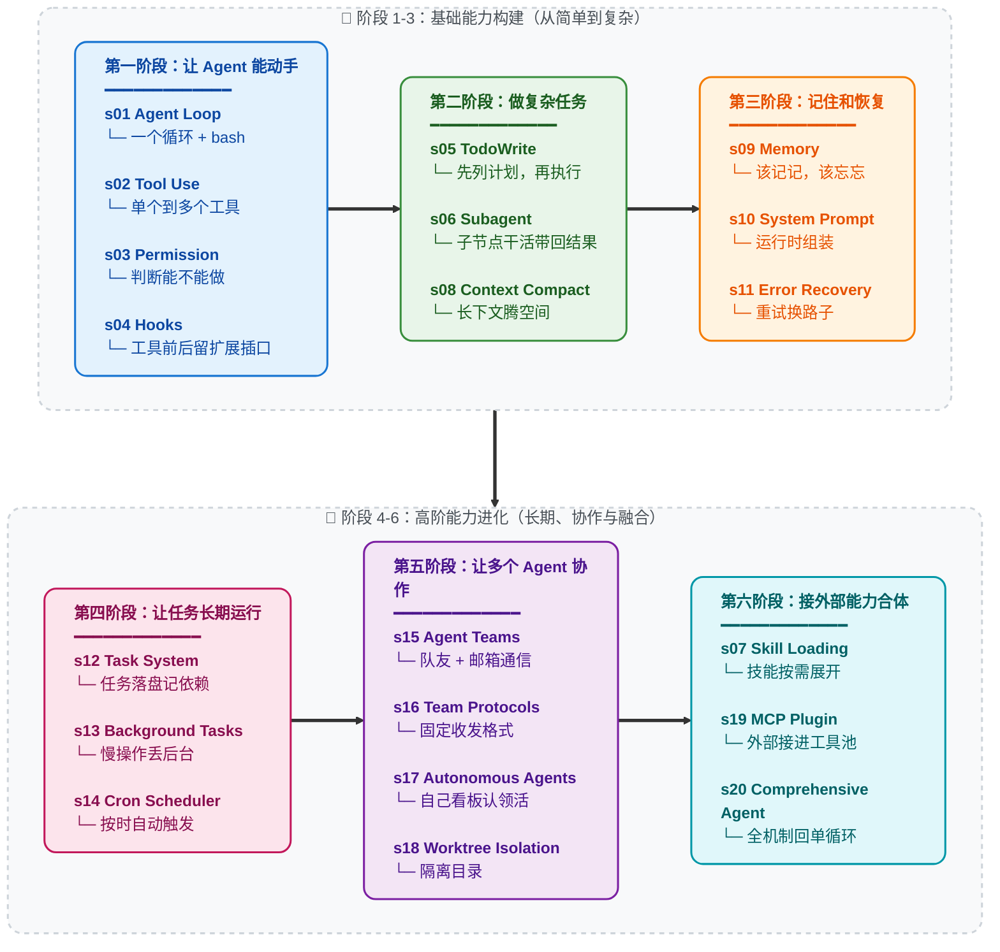

# Learn Claude Code

[English](./README.md) | [中文](./README-zh.md) | [日本語](./README-ja.md)

<<<<<<< HEAD
## Agency 来自模型，Agent 产品 = 模型 + Harness

在讨论代码之前，先把一件事说清楚。

**Agency -- 感知、推理、行动的能力 -- 来自模型训练，不是来自外部代码的编排。** 但一个能干活的 agent 产品，需要模型和 harness 缺一不可。模型是驾驶者，harness 是载具。本仓库教你造载具。

### Agency 从哪来

Agent 的核心是一个神经网络 -- Transformer、RNN、一个被训练出来的函数 -- 经过数十亿次梯度更新，在行动序列数据上学会了感知环境、推理目标、采取行动。Agency 这个东西从来不是外面那层代码赋予的，而是模型在训练中学到的。

人类就是最好的例子。一个由数百万年进化训练出来的生物神经网络，通过感官感知世界，通过大脑推理，通过身体行动。当 DeepMind、OpenAI 或 Anthropic 说 "agent" 时，他们说的核心都是同一件事：**一个通过训练学会了行动的模型，加上让它能在特定环境中工作的基础设施。**
=======
一个面向实现者的教学仓库：从零开始，手搓一个高完成度的 coding agent harness。

这里教的不是“如何逐行模仿某个官方仓库”，而是“如何抓住真正决定 agent 能力的核心机制”，用清晰、渐进、可自己实现的方式，把一个类似 Claude Code 的系统从 0 做到能用、好用、可扩展。

## 这个仓库到底在教什么

先把一句话说清楚：

**模型负责思考。代码负责给模型提供工作环境。**

这个“工作环境”就是 `harness`。  
对 coding agent 来说，harness 主要由这些部分组成：
>>>>>>> 5dfe67f4bd2a807e257351a14996b5ca58777969

- `Agent Loop`：不停地“向模型提问 -> 执行工具 -> 把结果喂回去”。
- `Tools`：读文件、写文件、改文件、跑命令、搜索内容。
- `Planning`：把大目标拆成小步骤，不让 agent 乱撞。
- `Context Management`：避免上下文越跑越脏、越跑越长。
- `Permissions`：危险操作先过安全关。
- `Hooks`：不改核心循环，也能扩展行为。
- `Memory`：把跨会话仍然有价值的信息保存下来。
- `Prompt Construction`：把系统说明、工具信息、约束和上下文组装好。
- `Tasks / Teams / Worktree / MCP`：让系统从单 agent 升级成更完整的工作平台。

本仓库的目标，是让你真正理解这些机制为什么存在、最小版本怎么实现、什么时候该升级到更完整的版本。

## 这个仓库不教什么

本仓库**不追求**把某个真实生产仓库的所有实现细节逐条抄下来。

下面这些内容，如果和 agent 的核心运行机制关系不大，就不会占据主线篇幅：

- 打包、编译、发布流程
- 跨平台兼容层的全部细节
- 企业策略、遥测、远程控制、账号体系的完整接线
- 为了历史兼容或产品集成而出现的大量边角判断
- 只对某个特定内部运行环境有意义的命名或胶水代码

<<<<<<< HEAD
每一个里程碑都指向同一个事实：**Agency -- 那个感知、推理、行动的能力 -- 是训练出来的，不是编出来的。** 但每一个 agent 同时也需要一个环境才能工作：Atari 模拟器、Dota 2 客户端、星际争霸 II 引擎、IDE 和终端。模型提供智能，环境提供行动空间。两者合在一起才是一个完整的 agent。
=======
这不是偷懒，而是教学取舍。
>>>>>>> 5dfe67f4bd2a807e257351a14996b5ca58777969

一个好的教学仓库，应该优先保证三件事：

1. 读者能从 0 到 1 自己做出来。
2. 读者不会被大量无关细节打断心智。
3. 真正关键的机制、数据结构和模块协作关系讲得完整、准确、没有幻觉。

## 面向的读者

这个仓库默认读者是：

- 会一点 Python
- 知道函数、类、字典、列表这些基础概念
- 但不一定系统做过 agent、编译器、分布式系统或复杂工程架构

所以这里会坚持几个写法原则：

- 新概念先解释再使用。
- 同一个概念尽量只在一个地方完整讲清。
- 先讲“它是什么”，再讲“为什么需要”，最后讲“如何实现”。
- 不把初学者扔进一堆互相引用的碎片文档里自己拼图。

## 学习承诺

学完这套内容，你应该能做到两件事：

1. 自己从零写出一个结构清楚、可运行、可迭代的 coding agent harness。
2. 看懂更复杂系统时，知道哪些是主干机制，哪些只是产品化外围细节。

我们追求的是：

- 对关键机制和关键数据结构的高保真理解
- 对实现路径的高可操作性
- 对教学路径的高可读性

而不是把“原始源码里存在过的所有复杂细节”一股脑堆给你。

## 建议阅读顺序

先读总览，再按顺序向后读。

- 总览：[`docs/zh/s00-architecture-overview.md`](./docs/zh/s00-architecture-overview.md)
- 代码阅读顺序：[`docs/zh/s00f-code-reading-order.md`](./docs/zh/s00f-code-reading-order.md)
- 术语表：[`docs/zh/glossary.md`](./docs/zh/glossary.md)
- 教学范围：[`docs/zh/teaching-scope.md`](./docs/zh/teaching-scope.md)
- 数据结构总表：[`docs/zh/data-structures.md`](./docs/zh/data-structures.md)

## 第一次打开仓库，最推荐这样走

如果你是第一次进这个仓库，不要随机点章节。

最稳的入口顺序是：

1. 先看 [`docs/zh/s00-architecture-overview.md`](./docs/zh/s00-architecture-overview.md)，确认系统全景。
2. 再看 [`docs/zh/s00d-chapter-order-rationale.md`](./docs/zh/s00d-chapter-order-rationale.md)，确认为什么主线必须按这个顺序长出来。
3. 再看 [`docs/zh/s00f-code-reading-order.md`](./docs/zh/s00f-code-reading-order.md)，确认本地 `agents/*.py` 该按什么顺序打开。
4. 然后按四阶段读主线：`s01-s06 -> s07-s11 -> s12-s14 -> s15-s19`。
5. 每学完一个阶段，停下来自己手写一个最小版本，不要等全部看完再回头补实现。

如果你读到一半开始打结，最稳的重启顺序是：

1. [`docs/zh/data-structures.md`](./docs/zh/data-structures.md)
2. [`docs/zh/entity-map.md`](./docs/zh/entity-map.md)
3. 当前卡住章节对应的桥接文档
4. 再回当前章节正文

## Web 学习入口

如果你更喜欢先看可视化的主线、阶段和章节差异，可以直接跑本仓库自带的 web 教学界面：

```sh
cd web
npm install
npm run dev
```

然后按这个顺序打开：

- `/zh`：总入口，适合第一次进入仓库时选学习路线
- `/zh/timeline`：看整条主线如何按顺序展开
- `/zh/layers`：看四阶段边界，适合先理解为什么这样分层
- `/zh/compare`：当你开始分不清两章差异时，用来做相邻对比或阶段跳跃诊断

如果你是第一次学，推荐先走 `timeline`。  
如果你已经读到中后段开始混，优先看 `layers` 和 `compare`，不要先硬钻源码。

### 桥接阅读

下面这些文档不是新的主线章节，而是帮助你把中后半程真正讲透的“桥接层”：

- 为什么是这个章节顺序：[`docs/zh/s00d-chapter-order-rationale.md`](./docs/zh/s00d-chapter-order-rationale.md)
- 本仓库代码阅读顺序：[`docs/zh/s00f-code-reading-order.md`](./docs/zh/s00f-code-reading-order.md)
- 参考仓库模块映射图：[`docs/zh/s00e-reference-module-map.md`](./docs/zh/s00e-reference-module-map.md)
- 查询控制平面：[`docs/zh/s00a-query-control-plane.md`](./docs/zh/s00a-query-control-plane.md)
- 一次请求的完整生命周期：[`docs/zh/s00b-one-request-lifecycle.md`](./docs/zh/s00b-one-request-lifecycle.md)
- Query 转移模型：[`docs/zh/s00c-query-transition-model.md`](./docs/zh/s00c-query-transition-model.md)
- 工具控制平面：[`docs/zh/s02a-tool-control-plane.md`](./docs/zh/s02a-tool-control-plane.md)
- 工具执行运行时：[`docs/zh/s02b-tool-execution-runtime.md`](./docs/zh/s02b-tool-execution-runtime.md)
- 消息与提示词管道：[`docs/zh/s10a-message-prompt-pipeline.md`](./docs/zh/s10a-message-prompt-pipeline.md)
- 运行时任务模型：[`docs/zh/s13a-runtime-task-model.md`](./docs/zh/s13a-runtime-task-model.md)
- 队友-任务-车道模型：[`docs/zh/team-task-lane-model.md`](./docs/zh/team-task-lane-model.md)
- MCP 能力层地图：[`docs/zh/s19a-mcp-capability-layers.md`](./docs/zh/s19a-mcp-capability-layers.md)
- 系统实体边界图：[`docs/zh/entity-map.md`](./docs/zh/entity-map.md)

<<<<<<< HEAD
- **策划知识。** 给 agent 领域专长。产品文档、架构决策记录、风格指南、合规要求。按需加载（s07），不要前置塞入。Agent 应该知道有什么可用，然后自己拉取所需。

- **管理上下文。** 给 agent 干净的记忆。子 agent 隔离（s06）防止噪声泄露。上下文压缩（s08）防止历史淹没。任务系统（s12）让目标持久化到单次对话之外。
=======
### 四阶段主线

| 阶段 | 目标 | 章节 |
|---|---|---|
| 阶段 1 | 先做出一个能工作的单 agent | `s01-s06` |
| 阶段 2 | 再补安全、扩展、记忆、提示词、恢复 | `s07-s11` |
| 阶段 3 | 把临时清单升级成真正的任务系统 | `s12-s14` |
| 阶段 4 | 从单 agent 升级成多 agent 与外部工具平台 | `s15-s19` |
>>>>>>> 5dfe67f4bd2a807e257351a14996b5ca58777969

### 全部章节

| 章节 | 主题 | 你会得到什么 |
|---|---|---|
| [s00](./docs/zh/s00-architecture-overview.md) | 架构总览 | 全局地图、名词、学习顺序 |
| [s01](./docs/zh/s01-the-agent-loop.md) | Agent Loop | 最小可运行循环 |
| [s02](./docs/zh/s02-tool-use.md) | Tool Use | 工具注册、分发和 tool_result |
| [s03](./docs/zh/s03-todo-write.md) | Todo / Planning | 最小计划系统 |
| [s04](./docs/zh/s04-subagent.md) | Subagent | 上下文隔离与任务委派 |
| [s05](./docs/zh/s05-skill-loading.md) | Skills | 按需加载知识 |
| [s06](./docs/zh/s06-context-compact.md) | Context Compact | 上下文预算与压缩 |
| [s07](./docs/zh/s07-permission-system.md) | Permission System | 危险操作前的权限管道 |
| [s08](./docs/zh/s08-hook-system.md) | Hook System | 不改循环也能扩展行为 |
| [s09](./docs/zh/s09-memory-system.md) | Memory System | 跨会话持久信息 |
| [s10](./docs/zh/s10-system-prompt.md) | System Prompt | 提示词组装流水线 |
| [s11](./docs/zh/s11-error-recovery.md) | Error Recovery | 错误恢复与续行 |
| [s12](./docs/zh/s12-task-system.md) | Task System | 持久化任务图 |
| [s13](./docs/zh/s13-background-tasks.md) | Background Tasks | 后台执行与通知 |
| [s14](./docs/zh/s14-cron-scheduler.md) | Cron Scheduler | 定时触发 |
| [s15](./docs/zh/s15-agent-teams.md) | Agent Teams | 多 agent 协作基础 |
| [s16](./docs/zh/s16-team-protocols.md) | Team Protocols | 团队通信协议 |
| [s17](./docs/zh/s17-autonomous-agents.md) | Autonomous Agents | 自治认领与调度 |
| [s18](./docs/zh/s18-worktree-task-isolation.md) | Worktree Isolation | 并行隔离工作目录 |
| [s19](./docs/zh/s19-mcp-plugin.md) | MCP & Plugin | 外部工具接入 |

## 章节总索引：每章最该盯住什么

如果你是第一次系统学这套内容，不要把注意力平均分给所有细节。  
每章都先盯住 3 件事：

1. 这一章新增了什么能力。
2. 这一章的关键状态放在哪里。
3. 学完以后，你自己能不能把这个最小机制手写出来。

下面这张表，就是整套仓库最实用的“主线索引”。

| 章节 | 最该盯住的数据结构 / 实体 | 这一章结束后你手里应该多出什么 |
|---|---|---|
| `s01` | `messages` / `LoopState` | 一个最小可运行的 agent loop |
| `s02` | `ToolSpec` / `ToolDispatchMap` / `tool_result` | 一个能真正读写文件、执行动作的工具系统 |
| `s03` | `TodoItem` / `PlanState` | 一个能把大目标拆成步骤的最小计划层 |
| `s04` | `SubagentContext` / 子 `messages` | 一个能隔离上下文、做一次性委派的子 agent 机制 |
| `s05` | `SkillMeta` / `SkillContent` / `SkillRegistry` | 一个按需加载知识、不把所有知识塞进 prompt 的技能层 |
| `s06` | `CompactSummary` / `PersistedOutputMarker` | 一个能控制上下文膨胀的压缩层 |
| `s07` | `PermissionRule` / `PermissionDecision` | 一条明确的“危险操作先过闸”的权限管道 |
| `s08` | `HookEvent` / `HookResult` | 一套不改主循环也能扩展行为的插口系统 |
| `s09` | `MemoryEntry` / `MemoryStore` | 一套区分“临时上下文”和“跨会话记忆”的持久层 |
| `s10` | `PromptParts` / `SystemPromptBlock` | 一条可管理、可组装的输入管道 |
| `s11` | `RecoveryState` / `TransitionReason` | 一套出错后还能继续往前走的恢复分支 |
| `s12` | `TaskRecord` / `TaskStatus` | 一张持久化的工作图，而不只是会话内清单 |
| `s13` | `RuntimeTaskState` / `Notification` | 一套慢任务后台执行、结果延后回来的运行时层 |
| `s14` | `ScheduleRecord` / `CronTrigger` | 一套“时间到了就能自动开工”的定时触发层 |
| `s15` | `TeamMember` / `MessageEnvelope` | 一个长期存在、能反复接活的 agent 团队雏形 |
| `s16` | `ProtocolEnvelope` / `RequestRecord` | 一套团队之间可追踪、可批准、可拒绝的协议层 |
| `s17` | `ClaimPolicy` / `AutonomyState` | 一套队友能自己找活、自己恢复工作的自治层 |
| `s18` | `WorktreeRecord` / `TaskBinding` | 一套任务与隔离工作目录绑定的并行执行车道 |
| `s19` | `MCPServerConfig` / `CapabilityRoute` | 一套把外部工具与外部能力接入主系统的总线 |

## 如果你是初学者，最推荐这样读

### 读法 1：最稳主线

适合第一次系统接触 agent 的读者。

<<<<<<< HEAD
这就是 Claude Code 作为教学标本的意义：**它展示了当你信任模型、把工程精力集中在 harness 上时会发生什么。** 本仓库的课程（s01-s20）逐步拆解并重组 Claude Code 架构中的 harness 机制。学完之后，你理解的不只是 Claude Code 怎么工作，而是适用于任何领域、任何 agent 的 harness 工程通用原则。
=======
按这个顺序读：
>>>>>>> 5dfe67f4bd2a807e257351a14996b5ca58777969

`s00 -> s01 -> s02 -> s03 -> s04 -> s05 -> s06 -> s07 -> s08 -> s09 -> s10 -> s11 -> s12 -> s13 -> s14 -> s15 -> s16 -> s17 -> s18 -> s19`

### 读法 2：先做出能跑的，再补完整

适合“想先把系统搭出来，再慢慢补完”的读者。

按这个顺序读：

1. `s01-s06`
2. `s07-s11`
3. `s12-s14`
4. `s15-s19`

### 读法 3：卡住时这样回看

如果你在中后半程开始打结，先不要硬往下冲。

回看顺序建议是：

1. [`docs/zh/s00-architecture-overview.md`](./docs/zh/s00-architecture-overview.md)
2. [`docs/zh/data-structures.md`](./docs/zh/data-structures.md)
3. [`docs/zh/entity-map.md`](./docs/zh/entity-map.md)
4. 当前卡住的那一章

因为读者真正卡住时，往往不是“代码没看懂”，而是：

<<<<<<< HEAD
---

```
                    THE AGENT PATTERN
                    =================

    User --> messages[] --> LLM --> response
                                      |
                            stop_reason == "tool_use"?
                           /                          \
                         yes                           no
                          |                             |
                    execute tools                    return text
                    append results
                    loop back -----------------> messages[]


    这是最小循环。每个 AI Agent 都需要这个循环。
    模型决定何时调用工具、何时停止。
    代码只是执行模型的要求。
    本仓库教你构建围绕这个循环的一切 --
    让 agent 在特定领域高效工作的 harness。
```

**20 个递进式课程, 从简单循环到完整 Harness。**
**每个课程添加一个 harness 机制。每个机制有一句格言。**

> **s01** &nbsp; *"One loop & Bash is all you need"* &mdash; 一个工具 + 一个循环 = 一个 Agent
>
> **s02** &nbsp; *"加一个工具, 只加一个 handler"* &mdash; 循环不用动, 新工具注册进 dispatch map 就行
>
> **s03** &nbsp; *"先划边界, 再给自由"* &mdash; 先判断操作能不能做，要不要问用户
>
> **s04** &nbsp; *"挂在循环上, 不写进循环里"* &mdash; 在工具前后留插口，不改主循环也能扩展
>
> **s05** &nbsp; *"没有计划的 agent 走哪算哪"* &mdash; 先列步骤再动手, 完成率翻倍
>
> **s06** &nbsp; *"大任务拆小, 每个小任务干净的上下文"* &mdash; 子 Agent 自己干活，只把结果带回来
>
> **s07** &nbsp; *"用到时再加载, 别全塞 prompt 里"* &mdash; 技能先列目录，用到时再展开
>
> **s08** &nbsp; *"上下文总会满, 要有办法腾地方"* &mdash; 四层压缩策略, 便宜的先跑贵的后跑
>
> **s09** &nbsp; *"记住该记的, 忘掉该忘的"* &mdash; 三个子系统: 筛选、提取、整理
>
> **s10** &nbsp; *"prompt 是组装出来的, 不是写死的"* &mdash; 分段 + 按需拼接
>
> **s11** &nbsp; *"错误不是终点, 是重试的起点"* &mdash; 出错时会重试、腾空间、换路子
>
> **s12** &nbsp; *"大目标拆成小任务, 排好序, 持久化"* &mdash; 文件持久化的任务图, 多 agent 协作的基础
>
> **s13** &nbsp; *"慢操作丢后台, agent 继续思考"* &mdash; 后台线程跑命令, 完成后注入通知
>
> **s14** &nbsp; *"定时触发, 不需要人推"* &mdash; 按时间自动触发任务
>
> **s15** &nbsp; *"一个搞不定, 组队来"* &mdash; 持久化队友 + 异步邮箱
>
> **s16** &nbsp; *"队友之间要有约定"* &mdash; 用固定的请求-回复格式沟通
>
> **s17** &nbsp; *"队友自己看板, 有活就认领"* &mdash; 不需要领导逐个分配, 自组织
>
> **s18** &nbsp; *"各干各的目录, 互不干扰"* &mdash; 任务管目标, worktree 管目录, 按 ID 绑定
>
> **s19** &nbsp; *"能力不够? 插上 MCP"* &mdash; 把外部工具接进同一个工具池
>
> **s20** &nbsp; *"机制很多，循环一个"* &mdash; 前面所有机制回到一个完整 harness

---

## 核心模式

```python
def agent_loop(messages):
    while True:
        response = client.messages.create(
            model=MODEL, system=SYSTEM,
            messages=messages, tools=TOOLS,
        )
        messages.append({"role": "assistant",
                         "content": response.content})

        if response.stop_reason != "tool_use":
            return

        results = []
        for block in response.content:
            if block.type == "tool_use":
                output = TOOL_HANDLERS[block.name](**block.input)
                results.append({
                    "type": "tool_result",
                    "tool_use_id": block.id,
                    "content": output,
                })
        messages.append({"role": "user", "content": results})
```

每个课程在这个循环之上叠加一个 harness 机制 -- 循环本身始终不变。循环属于 agent。机制属于 harness。

## 版本说明

本仓库现在同时保留两条教程线：

- **新版主线：根目录 `s01-s20`**
  根目录下的 `s01_*` 到 `s20_*` 是新的主版本，也是当前推荐阅读路径。每章包含完整叙事 README、英文/日文译本、可运行的 `code.py`，以及必要的图示。
- **旧版过渡：`docs/`、`agents/`、当前 `web/`**
  这些仍保留旧 12 章体系，暂时用于已有读者、旧链接和 Web 平台过渡。

新读者请从根目录 `s01_agent_loop/` 读到 `s20_comprehensive/`。如果你是从旧链接或当前 Web 平台进入，大概率看到的是旧 12 章版本。旧版章节号和新版不完全一致，不要混用章节号。

### 旧版到新版的对应关系

| 旧 12 章版本 | 新 20 章版本 | 主题 |
|---|---|---|
| 旧 s01 | 新 s01 | Agent Loop |
| 旧 s02 | 新 s02 | Tool Use |
| 旧 s03 | 新 s05 | TodoWrite |
| 旧 s04 | 新 s06 | Subagent |
| 旧 s05 | 新 s07 | Skill Loading |
| 旧 s06 | 新 s08 | Context Compact |
| 旧 s07 | 新 s12 | Task System |
| 旧 s08 | 新 s13 | Background Tasks |
| 旧 s09 | 新 s15 | Agent Teams |
| 旧 s10 | 新 s16 | Team Protocols |
| 旧 s11 | 新 s17 | Autonomous Agents |
| 旧 s12 | 新 s18 | Worktree Isolation |
| 新版新增 | s03、s04、s09、s10、s11、s14、s19、s20 | Permission、Hooks、Memory、System Prompt、Error Recovery、Cron、MCP、Comprehensive Agent |

## 范围说明 (重要)

本仓库是一个 0->1 的 harness 工程学习项目 -- 构建围绕 agent 模型的工作环境。
为保证学习路径清晰，仓库有意简化或省略了部分生产机制：

- 完整事件 / Hook 总线 (例如 PreToolUse、SessionStart/End、ConfigChange)。
  s12 仅提供教学用途的最小 append-only 生命周期事件流。
- 基于规则的权限治理与信任流程
- 会话生命周期控制 (resume/fork) 与更完整的 worktree 生命周期控制
- 完整 MCP 运行时细节 (transport/OAuth/资源订阅/轮询)

仓库中的团队 JSONL 邮箱协议是教学实现，不是对任何特定生产内部实现的声明。
=======
- 这个机制到底接在系统哪一层
- 这个状态到底存在哪个结构里
- 这个名词和另一个看起来很像的名词到底差在哪
>>>>>>> 5dfe67f4bd2a807e257351a14996b5ca58777969

## 快速开始

### 新版 20 章主线

```sh
git clone https://github.com/shareAI-lab/learn-claude-code
cd learn-claude-code
pip install -r requirements.txt
<<<<<<< HEAD
cp .env.example .env   # 编辑 .env 填入你的 ANTHROPIC_API_KEY

python s01_agent_loop/code.py        # 起点 — 一个循环 + bash
python s08_context_compact/code.py    # 上下文压缩（复杂章）
python s20_comprehensive/code.py      # 终点章: 全部机制归到一个循环
```

### 旧版 12 章过渡线

```sh
python agents/s01_agent_loop.py
python agents/s12_worktree_task_isolation.py
python agents/s_full.py
```

### Web 平台

当前 Web 平台仍读取 `docs/` 中的旧 12 章内容。新版 20 章请直接阅读根目录 `s01-s20`。
=======
cp .env.example .env
```

把 `.env` 里的 `ANTHROPIC_API_KEY` 或兼容接口配置好以后：
>>>>>>> 5dfe67f4bd2a807e257351a14996b5ca58777969

```sh
python agents/s01_agent_loop.py
python agents/s18_worktree_task_isolation.py
python agents/s19_mcp_plugin.py
python agents/s_full.py
```

建议顺序：

<<<<<<< HEAD
主线：能动手 → 能做复杂任务 → 能记住和恢复 → 能长期运行 → 能协作 → 能扩展并合体


=======
1. 先跑 `s01`，确认最小循环真的能工作。
2. 一边读 `s00`，一边按顺序跑 `s01 -> s10`。
3. 等前 10 章吃透后，再进入 `s11 -> s19`。
4. 最后再看 `s_full.py`，把所有机制放回同一张图里。

## 如何读这套教程

每章都建议按这个顺序看：

1. `问题`：没有这个机制会出现什么痛点。
2. `概念定义`：先把新名词讲清楚。
3. `最小实现`：先做最小但正确的版本。
4. `核心数据结构`：搞清楚状态到底存在哪里。
5. `主循环如何接入`：它如何与 agent loop 协作。
6. `这一章先停在哪里`：先守住什么边界，哪些扩展可以后放。

如果你是初学者，不要着急追求“一次看懂所有复杂机制”。  
先把每章的最小实现真的写出来，再理解升级版边界，会轻松很多。

如果你在阅读中经常冒出这两类问题：

- “这一段到底算主线，还是维护者补充？”
- “这个状态到底存在哪个结构里？”

建议随时回看：

- [`docs/zh/teaching-scope.md`](./docs/zh/teaching-scope.md)
- [`docs/zh/data-structures.md`](./docs/zh/data-structures.md)
- [`docs/zh/entity-map.md`](./docs/zh/entity-map.md)

## 本仓库的教学取舍

为了保证“从 0 到 1 可实现”，本仓库会刻意做这些取舍：

- 先教最小正确版本，再讲扩展边界。
- 如果一个真实机制很复杂，但主干思想并不复杂，就先讲主干思想。
- 如果一个高级名词出现了，就解释它是什么，不假设读者天然知道。
- 如果一个真实系统里某些边角分支对教学价值不高，就直接删掉。

这意味着本仓库追求的是：

**核心机制高保真，外围细节有取舍。**

这也是教学仓库最合理的做法。
>>>>>>> 5dfe67f4bd2a807e257351a14996b5ca58777969

## 全部章节

| 章节 | 主题 | 关键概念 |
|---|---|---|
| [s01](./s01_agent_loop/) | Agent Loop | `messages` / `while True` / `stop_reason` |
| [s02](./s02_tool_use/) | Tool Use | `TOOL_HANDLERS` / dispatch map / 并发 |
| [s03](./s03_permission/) | Permission | `PermissionRule` / 审批管线 |
| [s04](./s04_hooks/) | Hooks | `PreToolUse` / `PostToolUse` / 扩展点 |
| [s05](./s05_todo_write/) | TodoWrite | `TodoItem` / 先计划后执行 |
| [s06](./s06_subagent/) | Subagent | `fresh messages[]` / 上下文隔离 |
| [s07](./s07_skill_loading/) | Skill Loading | `SkillManifest` / 按需注入 |
| [s08](./s08_context_compact/) | Context Compact | snip / micro / budget / auto 四层压缩 |
| [s09](./s09_memory/) | Memory | selection / extraction / consolidation |
| [s10](./s10_system_prompt/) | System Prompt | 运行时组装 / 分段拼接 |
| [s11](./s11_error_recovery/) | Error Recovery | token 升级 / fallback 模型 / 重试策略 |
| [s12](./s12_task_system/) | Task System | `TaskRecord` / `blockedBy` / 磁盘持久化 |
| [s13](./s13_background_tasks/) | Background Tasks | 线程执行 / 通知队列 |
| [s14](./s14_cron_scheduler/) | Cron Scheduler | 持久化调度 / 会话级触发 |
| [s15](./s15_agent_teams/) | Agent Teams | `MessageBus` / 收件箱 / 权限冒泡 |
| [s16](./s16_team_protocols/) | Team Protocols | 关机握手 / 计划审批 |
| [s17](./s17_autonomous_agents/) | Autonomous Agents | 空闲循环 / 自动认领 |
| [s18](./s18_worktree_isolation/) | Worktree Isolation | `WorktreeRecord` / 任务-目录绑定 |
| [s19](./s19_mcp_plugin/) | MCP Plugin | 多传输 / 通道路由 / 工具池组装 |
| [s20](./s20_comprehensive/) | Comprehensive Agent | 全部机制归到一个循环 |

## 项目结构

```text
learn-claude-code/
<<<<<<< HEAD
  s01_agent_loop/          # 每章一个文件夹
    README.md              #   中文源文档（完整叙事）
    README.en.md           #   英文译本
    README.ja.md           #   日文译本
    code.py                #   独立可运行代码
    images/                #   SVG 流程图
  s02_tool_use/
  ...
  s19_mcp_plugin/
  s20_comprehensive/       # 终点章
  agents/                  # 旧 12 章可运行副本 + s_full.py
  skills/                  # s07 使用的 skill 文件
  docs/                    # 旧 12 章文档，过渡期保留
  web/                     # 当前仍基于 docs/ 旧版内容生成
  tests/
```

## 学完之后 -- 从理解到落地

20 个课程走完, 你已经从内到外理解了 harness 工程的运作原理。两种方式把知识变成产品:
=======
├── agents/              # 每一章对应一个可运行的 Python 参考实现
├── docs/zh/             # 中文主线文档
├── docs/en/             # 英文文档，当前为部分同步
├── docs/ja/             # 日文文档，当前为部分同步
├── skills/              # s05 使用的技能文件
├── web/                 # Web 教学平台
└── requirements.txt
```

## 语言说明

当前仓库以中文文档为主线，最完整、更新也最快。

- `zh`：主线版本
- `en`：部分同步
- `ja`：部分同步

如果你要系统学习，请优先看中文。

## 最后的目标
>>>>>>> 5dfe67f4bd2a807e257351a14996b5ca58777969

读完这套内容，你不应该只是“知道 Claude Code 很厉害”。

你应该能自己回答这些问题：

- 一个 coding agent 最小要有哪些状态？
- 工具调用和 `tool_result` 为什么是核心接口？
- 为什么要做子 agent，而不是把所有内容都塞在一个对话里？
- 权限、hook、memory、prompt、task 这些机制分别解决什么问题？
- 一个系统什么时候该从单 agent 升级成任务图、团队、worktree 和 MCP？

如果这些问题你都能清楚回答，而且能自己写出一个相似系统，那这套仓库就达到了它的目的。

---

<<<<<<< HEAD
## 姊妹教程: 从*被动临时会话*到*主动常驻助手*

本仓库教的 harness 属于 **用完即走** 型 -- 开终端、给 agent 任务、做完关掉, 下次重开是全新会话。Claude Code 就是这种模式。

但 [OpenClaw](https://github.com/openclaw/openclaw) 证明了另一种可能: 在同样的 agent core 之上, 加两个 harness 机制就能让 agent 从 "踹一下动一下" 变成 "自己隔 30 秒醒一次找活干":

- **心跳 (Heartbeat)** -- 每 30 秒 harness 给 agent 发一条消息, 让它检查有没有事可做。没事就继续睡, 有事立刻行动。
- **定时任务 (Cron)** -- agent 可以给自己安排未来要做的事, 到点自动执行。

再加上 IM 多通道路由 (WhatsApp/Telegram/Slack/Discord 等 13+ 平台)、不清空的上下文记忆、Soul 人格系统, agent 就从一个临时工具变成了始终在线的个人 AI 助手。

**[claw0](https://github.com/shareAI-lab/claw0)** 是我们的姊妹教学仓库, 从零拆解这些 harness 机制:

```
claw agent = agent core + heartbeat + cron + IM chat + memory + soul
```

```
learn-claude-code                   claw0
(agent harness 内核:                 (主动式常驻 harness:
 循环、工具、规划、                    心跳、定时任务、IM 通道、
 团队、worktree 隔离)                  记忆、Soul 人格)
```

## 许可证

MIT

---

**Agency 来自模型。Harness 让 agency 落地。造好 Harness，模型会完成剩下的。**

**Bash is all you need. Real agents are all the universe needs.**
=======
**这不是“照着源码抄”。这是“抓住真正关键的设计，然后自己做出来”。**
>>>>>>> 5dfe67f4bd2a807e257351a14996b5ca58777969
